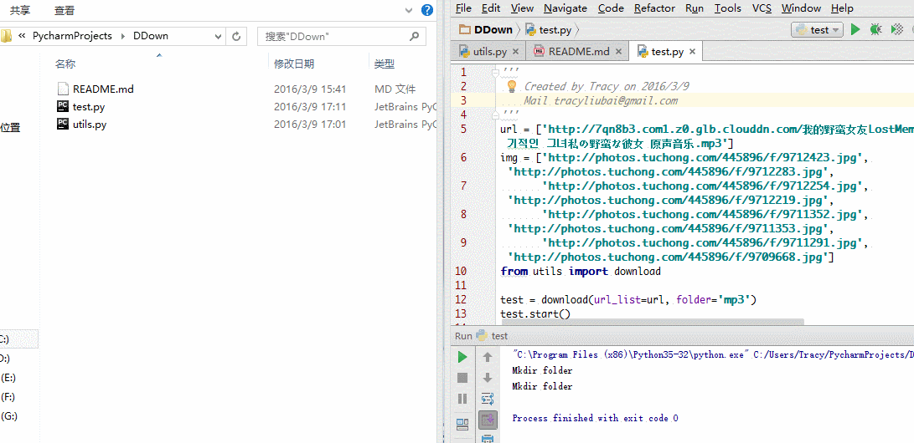

## Download web content 
## Just Give the list (path,folder available)
---
### Python 3.X

- It will generate folder using file postfix with your path
- [x] path  
- [ ] folder        
- Save the file in current path,folder you named
- [ ] path  
- [x] folder     
- Save in the folder you gave
- [x] path  
- [x] folder     
- It will generate folder using file postfix in your current path 
- [ ] path  
- [ ] folder   

## Support multi-language url

    'http://7qn8b3.com1.z0.glb.clouddn.com/我的野蛮女友LostMemory엽기적인 그녀私の野蛮な彼女 原声音乐.mp3'

## Support custom thread number

    test = download(url_list=url, folder='mp3', pool_num=150)
    test.start()  
    
## Recommend to give url list and folder name

    from utils import download
    test = download(url_list=url,folder='img')
    test.start()

